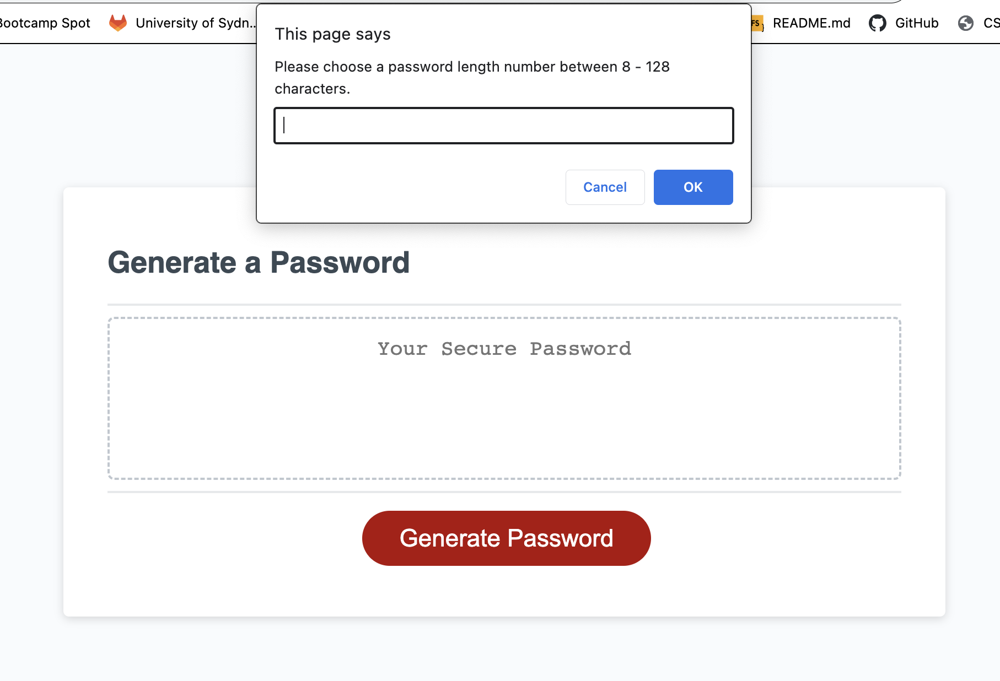

# Secure Password Generator

## Description

In today's world, it is important to be able to have security at your fingertips, which is why I created this Secure Password Generator, to ensure that there was a simple place to help create Secure Passwords for all your password needs. 
In addition to creating a secure password, it also allows you to select the extent of security you need, which includes Uppercase, Lowercase, Numerical, Special Characters and Password Length.

## Installation

Once your on the site, you click the Generate Password to activate the function itself.

You will then be guided through four different prompts to help the password generator tool create the bespoke secure password you are needing.

Once you have successfully completed the prompts, you will see a unique password generated based on your answers, which you can then copy and paste and use.

## Usage

You will see the user experience below, which shows the prompts you will get as well as the outcome of the generated secure password.


    ```md
    
    ```

## Credits

N/A

## License

N/A

## Badges

N/A

## Features

N/A

## How to Contribute

N/A

## Tests

N/A